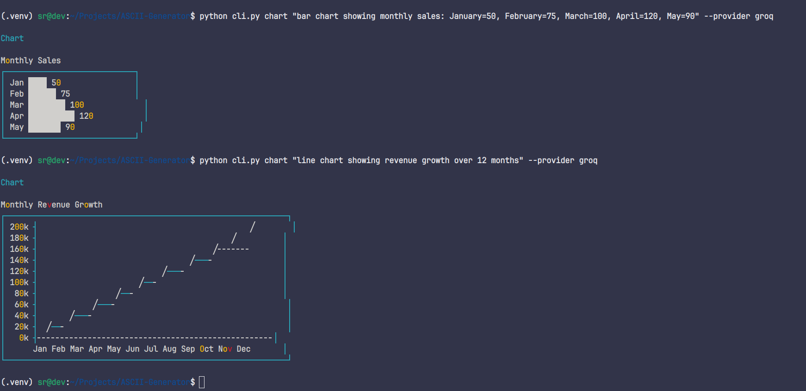
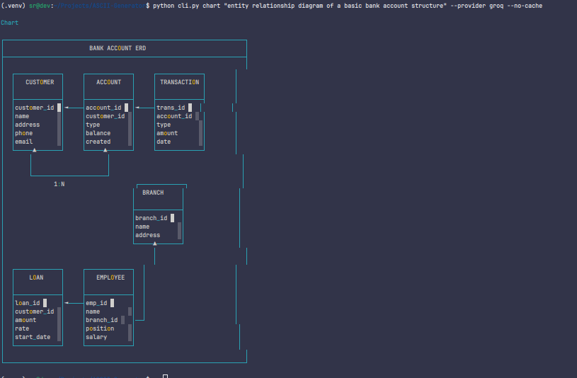

# ASCII Generator

A fast, intuitive CLI tool that generates ASCII art, charts, and diagrams using AI (Gemini or Groq). Create beautiful terminal visualizations from natural language prompts or by analyzing codebases.

## Features

-  **Intelligent Context-Aware Coloring** - Beautiful colors based on what you're drawing (NEW!)
-  **ASCII Art Generation** - Create detailed ASCII art from text descriptions
-  **Chart Generation** - Generate bar charts, line charts, and more with colorful data visualization
-  **Diagram Generation** - Create flowcharts and architecture diagrams with vibrant colors
-  **Live Streaming Mode** - Watch your ASCII being drawn in real-time with colors
-  **Codebase Analysis** - Auto-generate architecture diagrams from local code
-  **GitHub Integration** - Analyze GitHub repositories and generate diagrams
-  **Caching** - Fast repeated generation with intelligent caching
-  **Rate Limiting** - Respects API limits automatically

## Quick Installation (30 Seconds!)

```bash
cd ~/Projects/ASCII-Generator
./install.sh
```

The automated installer:
1. Installs the package in your virtual environment
2. Sets up a global `ascii` command (works from any directory!)
3. No manual virtual environment activation needed

After installation:
```bash
# Reload your shell
source ~/.bashrc  # or source ~/.zshrc

# First run triggers automatic API key setup wizard
ascii check

# Generate your first ASCII art!
ascii art "a cat" --live
```

**Get your free API keys:**
- **Groq**: https://console.groq.com/keys (Recommended, faster)
- **Gemini**: https://makersuite.google.com/app/apikey (Optional)

API keys are stored locally in `.env` file (never uploaded, private to you).

---

## Usage

No need to activate virtual environments - just use `ascii` from anywhere:

```bash
# From ANY directory:
ascii art "a cat wearing sunglasses"
ascii chart "Q1=100, Q2=150, Q3=200" --live
ascii diagram "user login flow" --provider groq
```

---

## Common Flags

| Flag | Description |
|------|-------------|
| `--live` | Show live progressive drawing animation |
| `--provider groq` | Use Groq API (default: auto) |
| `--provider gemini` | Use Gemini API |
| `--no-cache` | Disable caching for this request |
| `--no-colors` | Disable color output (monochrome) |
| `--explain` | Get explanation (charts/art only) |
| `--orientation left-to-right` | Horizontal diagram flow |
| `--orientation top-to-bottom` | Vertical diagram flow (default) |

---

### ASCII Art

Generate ASCII art from a text prompt:

```bash
ascii art "a cat wearing sunglasses"
ascii art "a rocket ship" --live
ascii art "Python logo" --provider groq
ascii art "a dragon" --explain  # Get an explanation
```

### Charts

Generate terminal-based charts:

```bash
ascii chart "Q1=100, Q2=150, Q3=120, Q4=200"
ascii chart "sales growth over 12 months" --live
ascii chart "monthly sales: Jan=50, Feb=75, Mar=100" --provider groq
ascii chart "Q1=100, Q2=150" --explain  # Get an explanation
```

**Example Output:**



*Example charts generated with Groq showing bar charts and line charts with proper formatting and visual representation.*

### Diagrams

Create flowcharts and diagrams:

```bash
ascii diagram "user login -> authenticate -> dashboard"
ascii diagram "frontend -> API -> database" --live
ascii diagram "oauth2 authentication flow" --provider groq
ascii diagram "CI/CD pipeline" --orientation left-to-right
```

**Example Output:**



*Example ERD diagram generated with Groq showing database structure with entities, attributes, and relationships.*

### Codebase Analysis

Generate architecture diagrams from local code:

```bash
ascii codebase /path/to/your/project
ascii codebase .  # Current directory
```

### GitHub Repository Analysis

Analyze GitHub repositories:

```bash
ascii github owner/repo-name
ascii github https://github.com/owner/repo
```

For private repositories, set `GITHUB_TOKEN` environment variable or use `--token`:

```bash
export GITHUB_TOKEN=your_github_token
ascii github owner/private-repo
```

### Other Commands

**Check configuration:**
```bash
ascii check  # Triggers setup wizard if .env doesn't exist
```

**Clear cache:**
```bash
ascii clear-cache
```

**Disable caching:**
```bash
ascii art "prompt" --no-cache
```

**Get explanations:**
```bash
ascii art "a cat" --explain
ascii chart "Q1=100, Q2=150" --explain
```

The `--explain` flag generates a brief explanation of the ASCII art or chart. Useful for understanding complex visualizations.

## Configuration

Create a `.env` file in the project root:

```env
GEMINI_API_KEY=your_gemini_api_key
GEMINI_MODEL=gemini-2.5-pro
GROQ_API_KEY=your_groq_api_key
GROQ_MODEL=moonshotai/kimi-k2-instruct-0905
CACHE_ENABLED=true
CACHE_DIR=.cache
```

**Model Options:**

Gemini Models:
- `gemini-2.5-pro` - Recommended: Good balance of capability and availability (default)
- `gemini-3-pro-preview` - Latest preview model (requires paid tier, may have availability issues)
- `gemini-2.5-flash` - Fast, efficient model
- `gemini-1.5-flash` - Free tier compatible
- `gemini-1.5-pro` - More capable model

Groq Models:
- `moonshotai/kimi-k2-instruct-0905` - Kimi K2 model (default)

## Project Structure

```
ASCII-Generator/
├── cli.py              # Main CLI entry point
├── config.py           # Configuration management
├── ai/
│   ├── client.py       # Abstract AI client interface
│   ├── gemini.py       # Google Gemini implementation
│   ├── groq_client.py  # Groq API implementation
│   ├── factory.py      # AI client factory (auto-select provider)
│   └── prompts.py      # System prompts
├── generators/
│   ├── ascii_art.py    # ASCII art generator
│   ├── charts.py       # Chart generator
│   └── diagrams.py     # Diagram generator
├── parsers/
│   ├── codebase.py     # Local codebase parser
│   └── github.py       # GitHub repository parser
├── renderer.py         # Terminal output with Rich
├── cache.py            # Caching system
├── rate_limiter.py     # Rate limiting
└── requirements.txt    # Dependencies
```

## API Limits

### Gemini Free Tier
- **15 requests per minute (RPM)**
- **1 million tokens per day**

### Groq Free Tier (Very Generous!)
- **60 requests per minute (RPM)**
- **1,000 requests per day**
- **10,000 tokens per minute**
- **300,000 tokens per day**

The rate limiter automatically handles these limits. If you hit the limit, the tool will wait before making the next request.

**Note:** Groq's free tier is much more generous than Gemini's, making it ideal for high-volume usage or when you need faster responses. The Kimi K2 model is particularly fast and well-suited for chart generation.

## Requirements

- Python 3.11+
- Google Gemini API key (free tier available)
- Internet connection for AI generation

## Dependencies

- `click` - CLI framework
- `rich` - Terminal formatting and colors
- `google-generativeai` - Google Gemini SDK
- `groq` - Groq API SDK (for Kimi K2 model)
- `python-dotenv` - Environment variable management
- `requests` - HTTP requests
- `PyGithub` - GitHub API client

## Examples

### Example 1: ASCII Art
```bash
$ python cli.py art "a coffee cup"
```

### Example 2: Chart
```bash
$ python cli.py chart "bar chart: January=50, February=75, March=100"
```

### Example 3: Architecture Diagram
```bash
$ python cli.py codebase ./my-project
```

### Example 4: GitHub Analysis
```bash
$ python cli.py github facebook/react
```

## Troubleshooting

**Error: GEMINI_API_KEY is required**
- Make sure you've created a `.env` file with your API key
- Or set the environment variable: `export GEMINI_API_KEY=your_key`

**Error: Rate limit exceeded**
- The tool automatically handles rate limiting, but if you see this, wait a minute and try again

**Error: GitHub token not configured**
- For private repositories, set `GITHUB_TOKEN` environment variable
- Or use `--token` flag: `python cli.py github owner/repo --token your_token`

## License

MIT License

## Contributing

Contributions are welcome! Please feel free to submit a Pull Request.

